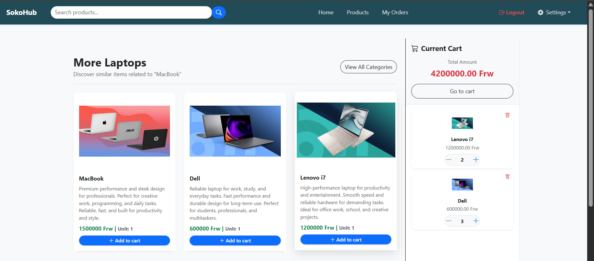

# SokoHub


---

## Project Overview

**SokoHub** is a modern, high-performance multi-vendor marketplace. It empowers vendors to manage their digital storefronts while providing customers with a seamless, automated shopping experience—from smart product discovery to automated PDF invoicing.

---

## Features

- **Authentication**: Users can register and log in.  
- **Landing Page / Home**: Displays the latest 8 products with a "Browse" button.  
- **Vendor Dashboard**:  
  - Add products  
  - View my products  
  - View my orders  
- **Products List Page**: Displays all products available after clicking the "Browse" button.  
- **Order Management**:  
  - Customers can place orders  
  - View all placed orders  

---

## Advanced Features

### 🛍️ Customer Experience

- **Smart Shopping**: Interactive "Add to Cart" functionality for a streamlined checkout.

- **Order Intelligence**: Filter order history by year or use the search bar to find specific past transactions.

- **Automated Invoicing**: View, download, or print professional invoices immediately after purchase.

- **Soft Invoices via Email**: Automatic email delivery of soft-copy invoices powered by SendGrid.

- **Product Discovery**: Full-text search, category-based related products, and high-quality product galleries.

### 🏪 Vendor Empowerment

- **Inventory Control**: Complete CRUD (Create, Read, Update, Delete) capabilities for vendor products.

- **Order Management**: Real-time editing of order statuses (Pending, Processed, Shipped, etc.).

- **Smart UX**: Real-time search, order history filtering by year, and vendor status management.


### 🔐 Security & Identity

* **Multi-Factor Authentication (MFA):** Enhanced account security via **Email OTP** or **Authenticator Apps** (Google Authenticator, Authy).
* **Social Auth:** One-click "Sign in with Google" for faster user onboarding.
* **Account Safety:** Secure password reset/change workflows and editable user profiles.
---
## Screenshots 

### Home Page

  

### Related products with Add to Cart


---

## Tech Stack


| Layer          | Technology               | Purpose                          |
|----------------|--------------------------|----------------------------------|
| Backend        | Django 5.2.8             | Core Framework                   |
| Auth           | django-allauth           | MFA & Social Login               |
| Database       | PostgreSQL (Supabase)    | Scalable Production Database     |
| Media Storage  | Cloudinary               | Image Hosting & Delivery         |
| Emails         | SendGrid                 | Transactional Invoicing          |


## Installation

1. **Clone the repository:**

```bash
git clone https://github.com/DamourDev/sokohub-system.git
cd sokohub-system
```
---


2. **Create a virtual environment**

```bash
python -m venv env
```
---


3. **Activate the virtual environment**

- Windows: ```env\Scripts\actiavte```
- Linux/Mac: ```source env/bin/actiavte```

---

4. **Install dependencies**

```bash
pip install -r requirements.txt
```

---

5. **Environment variables**

```env
# --- General Settings ---
SECRET_KEY=<YOUR_DJANGO_SECRET_KEY>
DEBUG=False
ALLOWED_HOSTS=<YOUR_PRODUCTION_DOMAIN>,localhost,127.0.0.1

# --- Database (Supabase / PostgreSQL) ---
DATABASE_URL=postgres://<USER>:<PASSWORD>@<HOST>:<PORT>/<DB_NAME>

# --- Media Storage (Cloudinary) ---
CLOUDINARY_CLOUD_NAME=<YOUR_CLOUD_NAME>
CLOUDINARY_API_KEY=<YOUR_API_KEY>
CLOUDINARY_API_SECRET=<YOUR_API_SECRET>

# --- Email Service (SendGrid) ---
SENDGRID_API_KEY=<YOUR_SENDGRID_API_KEY>
DEFAULT_FROM_EMAIL=<YOUR_VERIFIED_SENDER_EMAIL>

# --- Social Auth (Google) ---
GOOGLE_CLIENT_ID=<YOUR_GOOGLE_CLIENT_ID>
GOOGLE_CLIENT_SECRET=<YOUR_GOOGLE_CLIENT_SECRET>
```

---

6. **Running the Project**

```bash
python manage.py runserver
```

---

## Folder Structure
```
sokohub-system/
├── accounts/            # User authentication, MFA, and Google OAuth logic
├── products/            # Core marketplace logic: Catalog, Search, and Filtering
├── orders/              # Transactional logic: Add to Cart, Invoicing, and History
├── sokohub/             # Project-wide configuration (settings.py, urls.py, wsgi.py)
├── templates/           # Global HTML templates (base.py, navbar, footer)
├── static/              # Raw static assets (CSS, JS, Custom Images)
├── staticfiles/         # Collected assets for production (served by WhiteNoise)
├── media/               # Local user-uploaded files (if not using Cloudinary)
├── product_gallery/     # Organized storage for product image collections
├── product_images/      # Dedicated directory for primary product thumbnails
├── screenshots/         # Visual previews for the README documentation
├── decorators.py        # Custom utility decorators for access control/security
├── manage.py            # Django's command-line utility
├── requirements.txt     # List of all Python dependencies
├── Procfile             # Process file for Render/Heroku deployment
├── .env                 # Environment variables (Secret keys, DB URLs)
├── .gitignore           # Specifies files/folders for Git to ignore (env, .env)
└── README.md            # Project documentation
```

---

## Contribution
This project was created for learning, but anyone is welcome to contribute improvements to make it closer to a real marketplace.