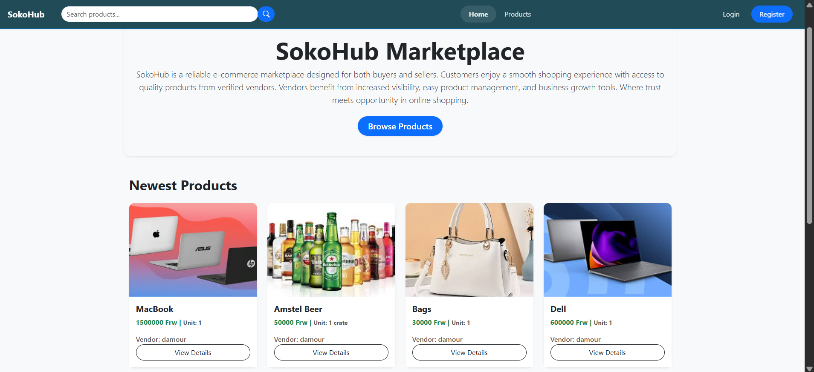

# SokoHub


---

## Project Overview

**SokoHub** is a marketplace system where vendors can manage products and customers can place orders.  
This project was initially created for learning purposes, but it can be improved into a real marketplace system.

---

## Features

- **Authentication**: Users can register and log in.  
- **Landing Page / Home**: Displays the latest 8 products with a "Browse" button.  
- **Vendor Dashboard**:  
  - Add products  
  - View my products  
  - View my orders  
- **Products List Page**: Displays all products available after clicking the "Browse" button.  
- **Order Management**:  
  - Customers can place orders  
  - View all placed orders  

---

## Screenshots

  


---

## Tech Stack

- **Backend**: Django 5.2.8  
- **Database**: SQLite  
- **Frontend**: Bootstrap (via CDN)  

> Note: Django REST Framework is installed but not used in the current version.

---

## Installation

1. **Clone the repository:**

```bash
git clone https://github.com/DamourDev/sokohub-system.git
cd sokohub-system
```
---


2. **Create a virtual environment**

```bash
python -m venv env
```
---


3. **Activate the virtual environment**

- Windows: ```env\Scripts\actiavte```
- Linux/Mac: ```source env/bin/actiavte```

---

4. **Install dependencies**

```bash
pip install -r requirements.txt
```

---

5. **Environment variables**

```env
SECRET_KEY='your-secret-key'
DEBUG=True
```

---

6. **Running the Project**

```bash
python manage.py runserver
```

---

## Folder Structure
```
sokohub-system/
├── accounts/ (User authentication)
├── products/ (Product management)
├── orders/ (Order management)
├── templates/ (base HTML templates)
├── screenshots/(screenshots for README)
├── sokohub/ (Project settings)
├── manage.py
├── requirements.txt
├── README.md
└── .env (Environment variables)
```

---

## Contribution
This project was created for learning, but anyone is welcome to contribute improvements to make it closer to a real marketplace.